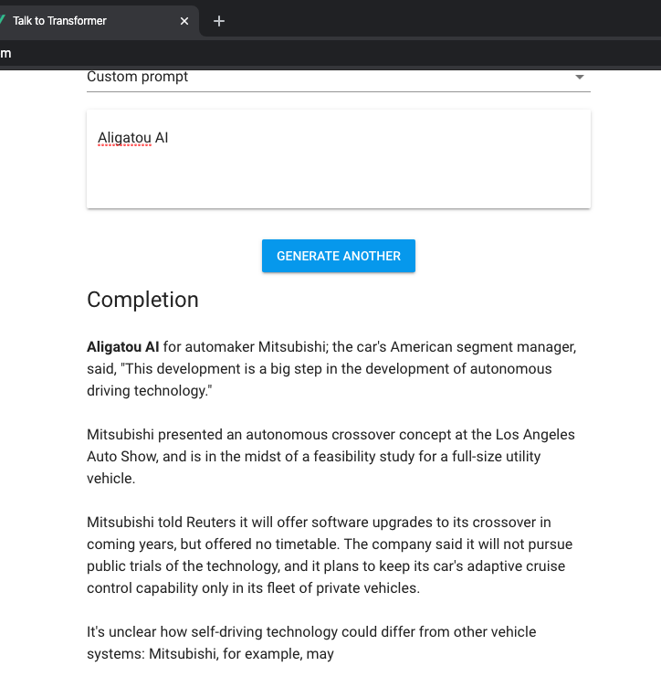
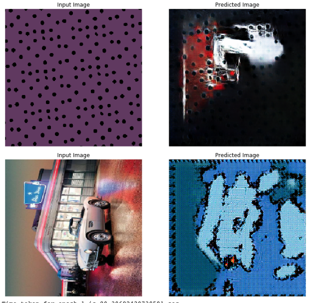

# AI Artathon Mini Project
##### By Aligatou AI - Team #15

## Our Concept (Autonomous Driving Tech)
Our instructors made this very clever idea to practice our new skills. So we have to come up with a name for a project. 
Then we entre our chosen name at [this website](https://talktotransformer.com/). This website is actualy a project 
related to text generation. So (here is the exsiting part) we take the generated text and make it as our Art Concept xD!! 

## Our Datasets 
- We used one original dataset that our artist made by himself. 
- And another datasets of cars that I scraped from the web.

## Dealing with Data
Augmentor is used to generate more examples from what we already have.

## The Cycle-GAN
Mainly we followed the provided example in the paper the one with the horses and zebras. 
Replaced these datasets with our Art and Cars.

